# RAGReader 

**Next-Generation Document QA with Multi-Method RAG & Multi-LLM Consensus**

RAGReader is an advanced AI-powered application designed to revolutionize how you interact with your documents. While it functions as a high-speed document chat interface using standard Vector Embedding RAG, its true power lies in its **"Deep Dive"** capability—orchestrating multiple retrieval strategies, rigorous evaluation metrics, and a democratic voting system between the world's leading LLMs to ensure the most accurate answer possible.

---

## Key Features

### 1. Standard Mode (Fast & Efficient)
*   **Dense RAG:** Utilizes high-performance vector embeddings to quickly retrieve relevant chunks from your uploaded files.
*   **LLM Backend:** Powered by OpenAI GPT for rapid and coherent response generation.

### 2. Deep Dive Mode (The "Click" Feature)
When accuracy is paramount, click the answer to trigger a comprehensive analysis pipeline:
*   **Retrieval Method:** simultaneously employs:
    *   **Dense RAG:** Semantic search.
    *   **Sparse RAG:** Keyword-based search (BM25/SPLADE).
    *   **Hybrid RAG:** Combining semantic and keyword scores.
    *   **Iterative RAG:** Multi-step reasoning to find complex answers.
    *   **Reranking:** Re-orders all chunks and takes the top k using a cross-encoder based on the user query

### 3. Evaluation & Validation
*   **Metrics:** Automatically calculates **MRR (Mean Reciprocal Rank)** , **Recall@K**,  and **Precision@K** scores to grade the quality of retrieved data.
*   **The "Council of AI":** A consensus voting mechanism where three distinct LLMs evaluate the generated answers to pick the winner:
    *   **OpenAI GPT**
    *   **Anthropic Claude**
    *   **Google Gemini**

## Architectural Workflow

```mermaid
flowchart TD
    U[User] --> I[Input Source<br/>URL / PDF / Text]

    %% RAG Registry Initialization
    I --> RAG_REG[RAG Registry Init]
    RAG_REG --> META[Store RAG Metadata\nuser, source, config]

    %% Ingestion Pipeline
    RAG_REG --> CHUNK[Chunking Engine]
    CHUNK --> EMBED[Embedding]
    EMBED --> VECTOR[Vector Store]
    CHUNK --> FILE_STORE[Raw File Storage]
    META --> FILE_STORE

    %% Chat Entry
    VECTOR --> CHAT[Chat Session]
    FILE_STORE --> CHAT

    %% Query Flow
    CHAT --> QUERY[User Query]
    QUERY --> PFG[PFG / Prompt Flow Generator]

    %% Normal Chat (Dense Graph)
    PFG --> DENSE_GRAPH[Dense Graph Retrieval]
    DENSE_GRAPH --> DENSE_ANS[Answer\nDense Graph]

    DENSE_ANS --> BASIC_EVAL[MRR / Recall@3 / Precision]

    %% Deep Analysis Branch
    QUERY -->|Deep Analysis| DEEP[Deep Analysis Engine]

    %% Retrieval Methods
    DEEP --> DR[Dense Retrieval]
    DEEP --> SR[Sparse Retrieval]
    DEEP --> HR[Hybrid Retrieval]
    DEEP --> IR[Iterative Retrieval]
    DEEP --> RR[Reranker Retrieval]

    %% LLM Fan-out per Method
    DR --> GPT_D[GPT]
    DR --> CLAUDE_D[Claude]
    DR --> GEMINI_D[Gemini]

    SR --> GPT_S[GPT]
    SR --> CLAUDE_S[Claude]
    SR --> GEMINI_S[Gemini]

    HR --> GPT_H[GPT]
    HR --> CLAUDE_H[Claude]
    HR --> GEMINI_H[Gemini]

    IR --> GPT_I[GPT]
    IR --> CLAUDE_I[Claude]
    IR --> GEMINI_I[Gemini]

    RR --> GPT_R[GPT]
    RR --> CLAUDE_R[Claude]
    RR --> GEMINI_R[Gemini]

    %% Answer Objects
    GPT_D --> A1[Answer]
    CLAUDE_D --> A2[Answer]
    GEMINI_D --> A3[Answer]

    GPT_S --> A4[Answer]
    CLAUDE_S --> A5[Answer]
    GEMINI_S --> A6[Answer]

    GPT_H --> A7[Answer]
    CLAUDE_H --> A8[Answer]
    GEMINI_H --> A9[Answer]

    GPT_I --> A10[Answer]
    CLAUDE_I --> A11[Answer]
    GEMINI_I --> A12[Answer]

    GPT_R --> A13[Answer]
    CLAUDE_R --> A14[Answer]
    GEMINI_R --> A15[Answer]

    %% Evaluation per Answer (No Merge)
    A1 --> E1[MRR / Recall@3 / Precision]
    A2 --> E2[MRR / Recall@3 / Precision]
    A3 --> E3[MRR / Recall@3 / Precision]

    A4 --> E4[MRR / Recall@3 / Precision]
    A5 --> E5[MRR / Recall@3 / Precision]
    A6 --> E6[MRR / Recall@3 / Precision]

    A7 --> E7[MRR / Recall@3 / Precision]
    A8 --> E8[MRR / Recall@3 / Precision]
    A9 --> E9[MRR / Recall@3 / Precision]

    A10 --> E10[MRR / Recall@3 / Precision]
    A11 --> E11[MRR / Recall@3 / Precision]
    A12 --> E12[MRR / Recall@3 / Precision]

    A13 --> E13[MRR / Recall@3 / Precision]
    A14 --> E14[MRR / Recall@3 / Precision]
    A15 --> E15[MRR / Recall@3 / Precision]

    %% AI Vote Agreement
    E1 --> V1[AI Vote: Chunk & Answer Agreement]
    E2 --> V2[AI Vote: Chunk & Answer Agreement]
    E3 --> V3[AI Vote: Chunk & Answer Agreement]
    E4 --> V4[AI Vote: Chunk & Answer Agreement]
    E5 --> V5[AI Vote: Chunk & Answer Agreement]
    E6 --> V6[AI Vote: Chunk & Answer Agreement]
    E7 --> V7[AI Vote: Chunk & Answer Agreement]
    E8 --> V8[AI Vote: Chunk & Answer Agreement]
    E9 --> V9[AI Vote: Chunk & Answer Agreement]
    E10 --> V10[AI Vote: Chunk & Answer Agreement]
    E11 --> V11[AI Vote: Chunk & Answer Agreement]
    E12 --> V12[AI Vote: Chunk & Answer Agreement]
    E13 --> V13[AI Vote: Chunk & Answer Agreement]
    E14 --> V14[AI Vote: Chunk & Answer Agreement]
    E15 --> V15[AI Vote: Chunk & Answer Agreement]

    %% Output Layer
    E1 --> OUT[Multi-Answer View]
    E2 --> OUT
    E3 --> OUT
    E4 --> OUT
    E5 --> OUT
    E6 --> OUT
    E7 --> OUT
    E8 --> OUT
    E9 --> OUT
    E10 --> OUT
    E11 --> OUT
    E12 --> OUT
    E13 --> OUT
    E14 --> OUT
    E15 --> OUT
```

## Tech Stack

*   **LLM Orchestration:** OpenAI GPT, Anthropic Claude, Google Gemini.
*   **Embedding Models:** OpenAI Embeddings and Mini LM.
*   **Retrieval:** Hybrid Search, Dense, Sparse, Rerankers (e.g., Cohere/BGE), Iterative Dense
*   **Framework:** LangChain.
*   **Frontend:** React, Vite, Tailwind.
*   **Backend:** Django for the AI/RAG API

## Usage Guide

1.  **Upload:** Drag and drop your PDF, TXT, or MD files into the sidebar.
2.  **Ask:** Type your question in the chat input.
3.  **Read:** Get an immediate answer via Standard Dense RAG.
4.  **Deep Dive:** **Click the answer** to watch your query run through all AIs and methods.
    *   See each retrieval, reranking, and evaluation performed by the system and every AI model.
    *   Observe MRR and other metrics calculated at each step.
    *   See whether each AI agrees with the answer or not based on the chunk.

---

## Contributing

Contributions make the open-source community an amazing place to learn, inspire, and create. Any contributions you make are **greatly appreciated**.

1.  Fork the Project
2.  Create your Feature Branch (`git checkout -b feature/AmazingFeature`)
3.  Commit your Changes (`git commit -m 'Add some AmazingFeature'`)
4.  Push to the Branch (`git push origin feature/AmazingFeature`)
5.  Open a Pull Request

---

## License

Distributed under the MIT License. See `LICENSE` for more information.
